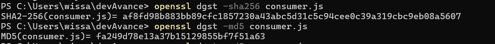
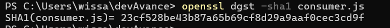
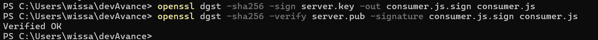
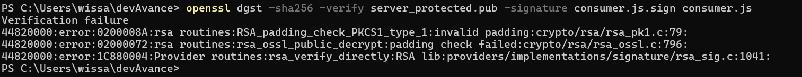
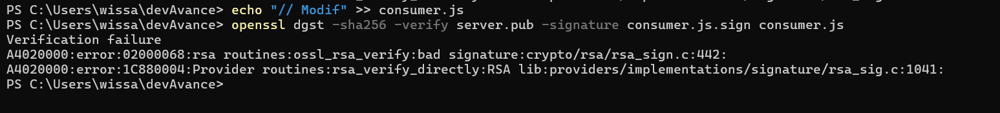

# DevAvanceTD4
Auteur : Wissal Zghrata

1.1 Taille par défaut : 2048 bits
Pour 4096 bits : ajouter le paramètre 4096 à la fin

1.2 openssl rsa -in server.key -pubout -out server.pub

2.1 commande bash suivante : openssl genrsa -des3 -out server_protected.key 2048 #protégée avec DES3

2.2 commande bash suivante : openssl rsa -in server_protected.key -pubout -out server_protected.pub
-> différence : demande du mdp + clé publique extraite est identique + header dans le fichier protégé généré .key "---BEGIN ENCRYPTED PRIVATE KEY-----"

3.1 commandes : 

*Tailles d'empreintes :*

- MD5: 128 bits (32 caractères hex)
- *HA-1: 160 bits (40 caractères hex)
3.2
- 
3.3
- 
